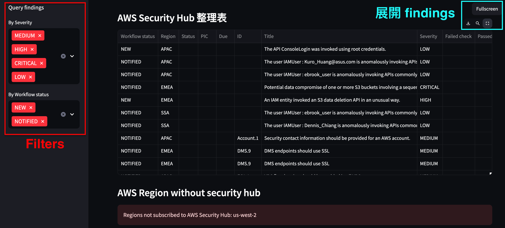

### Required Dependencies

- `boto3`
- `botocore`
- `pandas`
- `streamlit`
- `datetime`
- `typing`

### 工具說明

1. 整合並篩選來自 AWS Security Hub 的 Findings，並提供表格化的可視化界面，於 Streamlit 中展示與篩選

### 工具目的

1. 自動化整合多個 AWS Region 中的 Security Hub Findings。
2. 篩選並排序 Findings，以便快速瞭解不同 Region 的安全狀況。
3. 使用 Streamlit 提供即時可視化數據，方便分析與報告。

### Streamlit 操作說明

1. 左側的 _Query findings_ 可以篩選資料
2. 中間的 _AWS Security Hub 整理表_ 則是 AWS Security Hub 的 finding
3. query 完 finding 後，可展開所有 finding
   
